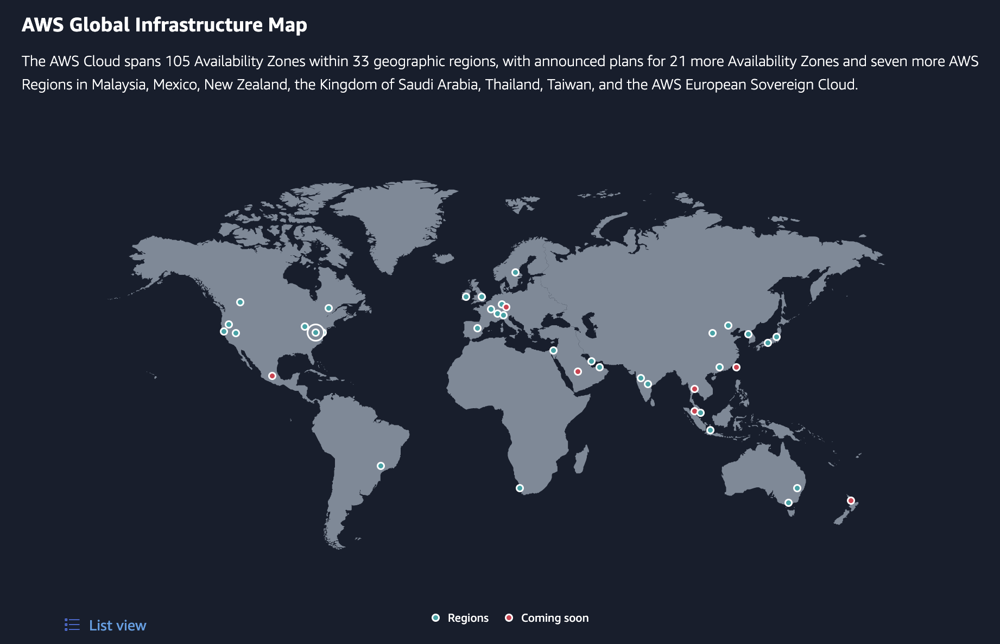

# Amazon Web Services (AWS)
## Cloud Computing with AWS
Amazon Web Services (AWS) là giải pháp đám mây toàn diện và được sử dụng rộng rãi nhất, cung cấp trên 200 dịch vụ đầy đủ tính năng từ các trung tâm dữ liệu trên toàn thế giới.
Hàng triệu khách hàng – bao gồm các công ty khởi nghiệp tăng trưởng nhanh nhất, các tập đoàn lớn nhất cũng như các cơ quan hàng đầu của chính phủ – đều tin tưởng vào AWS để giảm chi phí, trở nên linh hoạt hơn và đổi mới nhanh hơn.

## Cơ sở hạ tầng toàn cầu
- **33 Regions đã ra mắt** mỗi Khu vực có nhiều Vùng sẵn sàng
- **105 Availability Zones** (Vùng sẵn sàng)
- **Hơn 600 POP của CloudFront** và 13 bộ nhớ đệm biên Khu vực
- **41 Local Zones, 29 Wavelength Zones** dành cho các ứng dụng có độ trễ siêu thấp
- **Phục vụ 245 quốc gia và vùng lãnh thổ**
- **135 vị trí Direct Connect**

