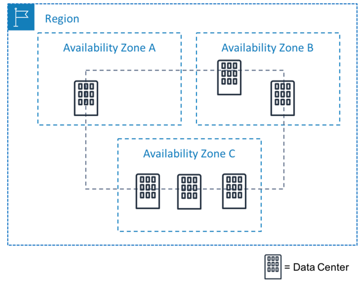

# Amazon Web Services (AWS)
## Cloud Computing with AWS
Amazon Web Services (AWS) là giải pháp đám mây toàn diện và được sử dụng rộng rãi nhất, cung cấp trên 200 dịch vụ đầy đủ tính năng từ các trung tâm dữ liệu trên toàn thế giới.
Hàng triệu khách hàng – bao gồm các công ty khởi nghiệp tăng trưởng nhanh nhất, các tập đoàn lớn nhất cũng như các cơ quan hàng đầu của chính phủ – đều tin tưởng vào AWS để giảm chi phí, trở nên linh hoạt hơn và đổi mới nhanh hơn.

## Cơ sở hạ tầng toàn cầu
- **33 Regions đã ra mắt** mỗi Khu vực có nhiều Vùng sẵn sàng
- **105 Availability Zones** (Vùng sẵn sàng)
- **Hơn 600 POP của CloudFront** và 13 bộ nhớ đệm biên Khu vực
- **41 Local Zones, 29 Wavelength Zones** dành cho các ứng dụng có độ trễ siêu thấp
- **Phục vụ 245 quốc gia và vùng lãnh thổ**
- **135 vị trí Direct Connect**

## Region
- Region (Khu vực) là các vị trí địa lý trên toàn thế giới nơi AWS lưu trữ các trung tâm dữ liệu.
- Mỗi Region AWS được liên kết với tên địa lý và mã Khu vực ví dụ: **us-east-1**, **ap-northeast-1**.

### Cách tiêu chí chọn Region
- **Data compliance**:
  + Các công ty doanh nghiệp thường phải tuân thủ các quy định yêu cầu dữ liệu khách hàng phải được lưu trữ trong một lãnh thổ địa lý cụ thể.
- **Latency**:
  + Nếu ứng dụng của bạn nhạy cảm với độ trễ (độ trễ giữa yêu cầu dữ liệu và phản hồi), hãy chọn Region gần với cơ sở người dùng của bạn.
  + Điều này giúp tránh thời gian chờ đợi lâu cho khách hàng của bạn.
- **Service Availability**:
  + Một số dịch vụ có thể không có sẵn ở một số Region.
- **Pricing**:
  + Giá cả sẽ khác nhau giữa các Khu vực.
  + Được công khai trên trang thông tin giá dịch vụ.

## Availability Zones (AZ)
- Bên trong mỗi Region là một cụm các AZ.
- Availability Zones bao gồm một hoặc nhiều data center có nguồn điện, mạng và kết nối dự phòng.
- Các data center này hoạt động tại các cơ sở riêng biệt ở những địa điểm không được tiết lộ. Chúng được kết nối bằng các liên kết dự phòng tốc độ cao và độ trễ thấp.
- Availability Zone cũng có tên mã như: **us-east-1a**, **us-east-1b**, **us-east-1c**

## Tham khảo
https://aws.amazon.com/about-aws/global-infrastructure/

https://docs.aws.amazon.com/whitepapers/latest/get-started-documentdb/aws-regions-and-availability-zones.html#:~:text=AWS%20Regions%20are%20separate%20geographic,high%20throughput%2C%20highly%20redundant%20networking.
