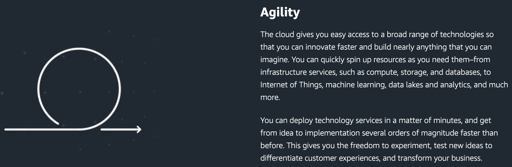
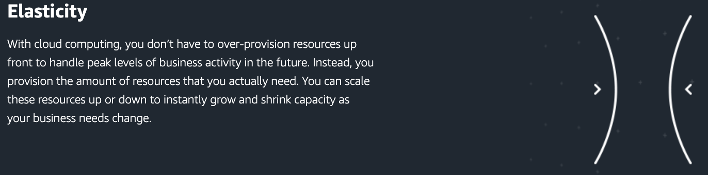
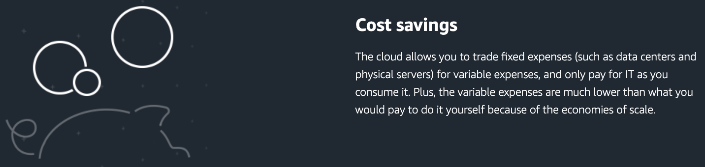
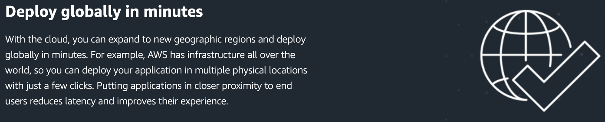

# Cloud Computing
## Cloud Computing là gì?
**Cloud Computing** (Điện toán đám mây) là việc cung cấp tài nguyên CNTT theo yêu cầu (On-demand) qua Internet với mức giá trả theo mức sử dụng (pay-as-you-go pricing).

Thay vì mua, vận hành và bảo trì các data center (trung tâm dữ liệu) và servers (máy chủ) vật lý, bạn có thể tiếp cận các dịch vụ IT như computing power, storage và database, dựa trên cơ sở khi cần từ các nhà cung cấp cloud như **Amazon Web Services** (AWS).

## Ai đang sử dụng Cloud Computing?
Các tổ chức với mọi quy mô, ngành nghề đang sử dụng cloud cho nhiều trường hợp khác nhau như:
- **Data backup** (sao lưu dữ liệu)
- **Disaster recovery** (Khắc phục sự số)
- **Email**
- **Virtual desktops** (Máy tính ảo)
- **Software development and testing** (Phát triển và kiểm thử phần mềm)
- **Big data analytics** (Phân tích dữ liệu lớn)
- **Customer-facing web applications** (Các ứng dụng web hướng tới khách hàng)

## Các mô hình triển khai Cloud Computing.
### **Cloud**
Ứng dụng trên nền tảng cloud được triển khai đầy đủ trên cloud và tất cả các bộ phận của ứng dụng đều chạy trên cloud.
### **Hybrid**
Triển khai theo hình thức Hybrid là một cách để kết nối các cơ sở hạ tầng và ứng dụng giữa các tài nguyên trên nền tảng Cloud và các tài nguyên hiện có không nằm trong cloud.
### **On-premise**
Việc triển khai các tài nguyên tại chỗ, sử dụng ảo hóa và cung cấp công cụ quản lý tài nguyên không đem đến nhiều lợi ích của điện toán đám mây nhưng đôi khi được chọn vì khả năng cung cấp tài nguyên chuyên dụng. 

## Lợi ích của Cloud Computing
### **Agility** (Nhanh chóng)
- Dễ dàng truy cập vào nhiều công nghệ.
- Nhanh chóng khai thác tài nguyên khi cần.
- Triển khai các dịch vụ công nghệ chỉ trong vài phút.

### **Elasticity** (Quy mô linh hoạt)
- Không cần phải cung cấp trước quá nhiều tài nguyên.
- Cung cấp tài nguyên thực sự cần.
- Có thể tăng hoặc giảm quy mô tài nguyên ngay lập tức.

### **Cost savings** (Tiết kiệm chi phí)
- Chuyển chi phí cố định (fixed expense) sang chi phí biến đổi (variable expense).
- Chỉ thanh toán cho tài nguyên sử dụng.
- Giảm chi phí nhờ tính kinh tế theo quy mô (economies of scale).

### **Deploy globally in minutes** (Triển khai trên toàn cầu trong vài phút)
- Có thể mở rộng sang các khu vực địa lý mới và triển khai trên toàn cầu chỉ trong vài phút.
- Đưa các ứng dụng đến gần người dùng cuối hơn sẽ giảm độ trễ và cải thiện trải nghiệm của họ.

## Các loại hình Cloud Computing
### Infrastructure as a Service (IaaS)
IaaS chứa các khối xây dựng cơ bản cho IT trên nền tảng đám mây.
Nó thường cung cấp quyền truy cập vào các tính năng mạng, máy tính (ảo hoặc trên phần cứng chuyên dụng) và không gian lưu trữ dữ liệu.
IaaS mang đến cho bạn mức độ linh hoạt cao nhất và khả năng kiểm soát quản lý đối với tài nguyên IT của bạn.
Nó gần giống nhất với các tài nguyên IT hiện có mà nhiều bộ phận IT và nhà phát triển quen thuộc.

### Platform as a Service (PaaS)
PaaS giúp bạn không cần quản lý cơ sở hạ tầng ngầm của tổ chức (thường là phần cứng và hệ điều hành) và cho phép bạn tập trung vào công tác triển khai cũng như quản lý các ứng dụng của mình.
Điều này giúp bạn làm việc hiệu quả hơn do bạn không cần phải lo lắng về việc thu mua tài nguyên, hoạch định dung lượng, bảo trì phần mềm, vá lỗi hay bất kỳ công việc nặng nhọc nào khác có liên quan đến việc vận hành ứng dụng. 

### Software as a Service (SaaS)
SaaS cung cấp cho bạn sản phẩm hoàn chỉnh được nhà cung cấp dịch vụ vận hành và quản lý.
Trong hầu hết các trường hợp, khi nhắc đến SaaS, mọi người thường nghĩ đến ứng dụng dành cho người dùng cuối (chẳng hạn như email trên nền tảng web).
Với SaaS, bạn không cần phải nghĩ cách duy trì dịch vụ hoặc cách quản lý cơ sở hạ tầng ngầm. Bạn sẽ chỉ cần nghĩ cách bạn sẽ sử dụng phần mềm cụ thể đó. 

## Tham khảo
https://aws.amazon.com/what-is-cloud-computing/

https://aws.amazon.com/types-of-cloud-computing/?nc1=h_ls
